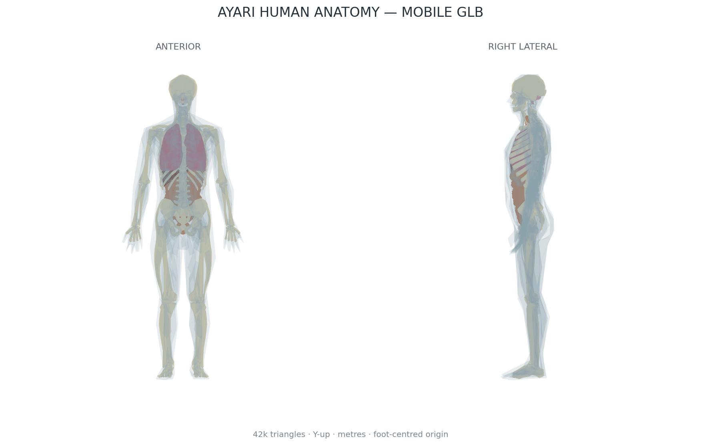

# AYARI Clinic Human Anatomy GLB

> 追加アセット: [`assets/cell/ayari_cell_cutaway.glb`](assets/cell/ayari_cell_cutaway.glb) — 指標別発光・ズーム対応の細胞カットアウェイモデル。仕様と実装例は [`assets/cell/README.md`](assets/cell/README.md) を参照してください。



AYARI Clinicのデータ可視化向けに3段階のLODを用意した、成人男性の全身解剖モデルです。骨格・脳・主要臓器は同一のBodyParts3D全身座標から生成しているため、部位を個別に目測配置したモデルではありません。

## 納品アセット

- [`assets/anatomy/ayari_human_anatomy.glb`](assets/anatomy/ayari_human_anatomy.glb) — LOD2高精細版、既定モデル
- [`assets/anatomy/ayari_human_anatomy_lod1_standard.glb`](assets/anatomy/ayari_human_anatomy_lod1_standard.glb) — LOD1標準版
- [`assets/anatomy/ayari_human_anatomy_lod0_mobile.glb`](assets/anatomy/ayari_human_anatomy_lod0_mobile.glb) — LOD0モバイル版
- `model_report*.json` — 各LODのポリゴン数、部位境界、FMA ID、Locator座標
- [`assets/anatomy/preview.png`](assets/anatomy/preview.png) — 正面・右側面のQAプレビュー

| LOD | 想定用途 | 三角形 | 頂点 | サイズ |
|---|---|---:|---:|---:|
| LOD2 High（既定） | 診察室LED、大画面、PC | 229,319 | 114,423 | 約5.3 MB |
| LOD1 Standard | タブレット、高性能スマートフォン | 91,483 | 45,985 | 約2.2 MB |
| LOD0 Mobile | 一般スマートフォン、通信量優先 | 42,331 | 21,554 | 約1.1 MB |

全LOD共通で、glTF 2.0 binary、20メッシュ、25 Locator、メートル単位、Y-up右手系、足元床面原点です。単位法線を持ち、UV・テクスチャ、リグ、アニメーションは含みません。

BodyParts3Dの元座標はmm単位、Zが頭側です。ビルド時に `X → X`、`Z → Y`、`Y → Z` としてメートルへ変換しています。モデルの外形は約1.65 mです。

## Node構造

```text
AYARI_Human_Adult_Male
├── GEOMETRY
│   ├── GEO_skin
│   ├── GEO_skeleton
│   ├── GEO_brain
│   └── GEO_<organ>
└── LOCATORS
    ├── 心臓
    ├── 肺 / 右肺 / 左肺
    ├── 肝臓 / 胃 / 膵臓 / 脾臓
    ├── 腎臓 / 右腎臓 / 左腎臓
    ├── 副腎 / 右副腎 / 左副腎
    ├── 小腸 / 大腸 / 膀胱 / 前立腺
    ├── 気管 / 食道 / 脳 / 骨格 / 骨 / 皮膚
    └── 炎症
```

LocatorはglTFの空Nodeで、`mesh`を持ちません。各Nodeの`extras`には以下を格納しています。

```json
{
  "nodeType": "locator",
  "markerKey": "心臓",
  "emissiveColor": "#c9a96e",
  "genericFallback": false
}
```

`炎症` は臓器指定がない実データ向けの汎用フォールバックで、初期位置は心臓中心です。データに対象臓器が含まれる場合は、必ず臓器固有のLocatorを優先してください。

## Three.jsでの利用

[`examples/threejs/load-anatomy.js`](examples/threejs/load-anatomy.js) はLOD選択、Locatorの収集、金色発光マーカーの追従例です。

```js
loader.load('/assets/anatomy/ayari_human_anatomy.glb', ({ scene }) => {
  const heart = scene.getObjectByName('心臓');
  heart.add(createGoldMarker());
  threeScene.add(scene);
});
```

glTF内のメートルスケールをそのまま使用するため、読み込み後の一括スケール変更は不要です。

## 再生成と検証

Python 3.12を想定しています。

```bash
python -m pip install -r requirements.txt
python tools/build_anatomy_glb.py \
  --triangle-scale 6 --max-triangles 300000 --profile-name lod2-high
python tools/validate_anatomy_glb.py \
  assets/anatomy/ayari_human_anatomy.glb \
  --report assets/anatomy/model_report.json \
  --max-triangles 300000
```

ビルダーはBodyParts3Dの固定コミットから必要なSTLだけを部分取得し、208骨部位、31脳領域、主要臓器を統合・軽量化します。生成物はKhronos glTF Validatorでもエラー・警告ともに0件です。

## 解剖学的精度と用途制限

形状と相対位置は、DBCLSのBodyParts3D release 3.0（成人男性1例の全身解剖アトラス）を基準としています。これは一般的な解剖位置の説明、検査値や老化指標の臓器別マッピング、患者向け可視化を想定したリファレンスモデルです。

個人差、性差、病変、臓器変形を表す患者固有モデルではありません。高精細版を含め、診断、手術計画、寸法計測、医療機器の判断根拠には使用できません。医療用途へ拡張する場合は、放射線科医・解剖学専門家によるレビューと、用途別の検証が別途必要です。

## 出典・ライセンス

形状データはBodyParts3D release 3.0から派生しています。派生GLBは元データと同じ [CC BY-SA 2.1 Japan](https://creativecommons.org/licenses/by-sa/2.1/jp/deed.en) 条件です。詳細は [`assets/anatomy/LICENSE_BODY_PARTS_3D.txt`](assets/anatomy/LICENSE_BODY_PARTS_3D.txt) を参照してください。

> BodyParts3D, (c) The Database Center for Life Science licensed under CC Attribution-Share Alike 2.1 Japan

参考論文: Mitsuhashi N, et al. *BodyParts3D: 3D structure database for anatomical concepts.* Nucleic Acids Res. 2009;37(Database issue):D782–D785. [doi:10.1093/nar/gkn613](https://doi.org/10.1093/nar/gkn613)
