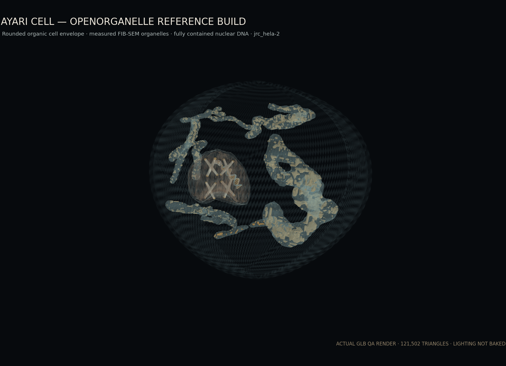

# AYARI Cell Cutaway GLB



AYARI Clinicの指標可視化向けに制作した、医療ラグジュアリー調の細胞カットアウェイモデルです。細胞膜は、Janelia OpenOrganelle `jrc_hela-2` の実測ラベルを形態参照・provenanceとして保持しつつ、培養細胞の扁平さや隣接細胞との接触面を表示形状へ持ち込まない、丸みのある有機的なエンベロープです。核、核内クロマチン、7個のミトコンドリア外形と膜／クリステは実測FIB-SEMセグメンテーションから表面抽出しています。GLB本体に背景・ライト・カメラは含めず、ビューア側で金色 `#c9a96e` のリムライトや選択発光を追加する前提です。

## 納品アセット

- [`ayari_cell_cutaway.glb`](ayari_cell_cutaway.glb) — glTF 2.0 Binary、PBRマテリアル
- [`model_report.json`](model_report.json) — ポリゴン数、各サブメッシュ境界、viewer key対応表
- [`preview.png`](preview.png) — 暗色スタジオを想定したQA構図（背景・照明はGLBに未収録）
- [`SOURCE_DATA.md`](SOURCE_DATA.md) — 実測データ、ライセンス、node単位のprovenance
- [`../../tools/fetch_openorganelle_cell.py`](../../tools/fetch_openorganelle_cell.py) — 公開N5ラベル取得スクリプト
- [`../../tools/build_cell_glb.py`](../../tools/build_cell_glb.py) — 再生成スクリプト
- [`../../tools/render_cell_preview.py`](../../tools/render_cell_preview.py) — 実GLB形状からのQAレンダー
- [`../../tools/validate_cell_glb.py`](../../tools/validate_cell_glb.py) — 構造・寸法・予算検証
- [`../../examples/threejs/load-cell.js`](../../examples/threejs/load-cell.js) — 発光とズームの実装例

| 項目 | 仕様 |
|---|---|
| フォーマット | glTF 2.0 Binary（`.glb`） |
| 三角形 | 121,502 |
| 頂点 | 63,144 |
| ファイルサイズ | 約3.04 MB |
| メッシュ | 34（複数primitiveを含む） |
| 単位・軸 | メートル、Y-up、右手系 |
| 原点 | 細胞中心 `(0, 0, 0)` |
| 細胞膜 | 実測ラベルを形態参照とした有機的な丸形エンベロープ、約2.0 m幅、正面 `+Z` 側カットアウェイ |
| 核 | 実測表面、中心 `x=-0.35 m`、幅約0.6 m、実測クロマチンprimitive |
| ミトコンドリア | 実測7個、各個体に同一source IDの膜／クリステprimitive |
| 染色体・テロメア | 4染色体、各4末端、計16テロメア |
| DNA | 核内に完全包含した右巻き拡大インセット、2.2回転、24本の横木 |
| UV・テクスチャ | なし。単色PBRマテリアル |
| リグ・アニメーション | なし |
| 背景・ライト・カメラ | なし |

ガラス材には `KHR_materials_transmission`、`KHR_materials_ior`、`KHR_materials_volume`、`KHR_materials_specular` を使用しています。発光色はGLBへベイクしていないため、選択状態をビューア側で安全に制御できます。

## Node構造とmarkerKey

```text
AYARI_Cell_Cutaway
└── GEOMETRY
    ├── GEO_cell                         markerKey: cell
    ├── GEO_nucleus                      markerKey: cell
    ├── GEO_mitochondria_01 ... 07       markerKey: mito
    ├── GEO_chromosome_01 ... 04         markerKey: telo
    ├── GEO_telomere_01 ... 16           markerKey: telo
    ├── GEO_chromatin_fiber               markerKey: dna
    ├── GEO_nucleosome_01 ... 03          markerKey: dna
    └── GEO_dna                          markerKey: dna
```

すべての部位ノードに `extras.labelJa` と `extras.markerKey` を持たせています。

```json
{
  "labelJa": "ミトコンドリア",
  "markerKey": "mito",
  "category": "mitochondrion",
  "instance": 1,
  "cristaeIncluded": true
}
```

`GEO_cell` は実測foreground／plasma-membrane labelのsource情報と抽出履歴を保持した、滑らかな有機形状のカットアウェイ表面です。`GEO_nucleus` は実測核外形と実測クロマチンの2 primitive、`GEO_mitochondria_XX` は実測外形と同一個体IDの膜／クリステの2 primitiveです。DNA関連は `GEO_chromosome_01` の腕から `GEO_chromatin_fiber` → 3個の `GEO_nucleosome_XX` → `GEO_dna` へ連続する拡大インセットで、すべて核内に完全包含しています。`GEO_dna` 自体は2本の鎖と横木の3 primitiveです。同一部位としてまとめて発光・ズームできる一方、PBR材は内部要素ごとに分離されています。

## 実測データと教育用オーバーレイ

実測ソースは、wild-type interphase HeLa cellをFIB-SEMで取得したJanelia OpenOrganelle `jrc_hela-2`（native `4 × 4 × 5.24 nm/voxel`、CC BY 4.0）です。核とミトコンドリアのWeb用メッシュは、`64 × 64 × 83.84 nm` gridの公開N5 labelから生成しています。細胞foreground `s3` とplasma-membrane `s4` は、source label、sampling、対象細胞抽出履歴を保持し、表示用有機エンベロープの形態参照に使用しています。詳細は[`SOURCE_DATA.md`](SOURCE_DATA.md)を参照してください。

GLB内では、実測surfaceに `extras.measured: true`、表示用または教育用geometryに `extras.measured: false` と `extras.geometryProvenance` を付与しています。`jrc_hela-2` は間期細胞のため、X型染色体、テロメアキャップ、DNAパッケージング階層は同一時点の実測形状とはせず、教育用オーバーレイとして明示しています。DNAは細胞質に孤立させず、核内で染色体01へ接続しています。

| markerKey | 対象 |
|---|---|
| `cell` | 細胞膜、核 |
| `mito` | 7個のミトコンドリア |
| `telo` | 4染色体、16テロメア |
| `dna` | クロマチン繊維、3ヌクレオソーム、DNA二重らせん |

## Three.jsでの利用

```js
const { model, parts } = await loadAyariCell(scene);

// 指標選択時に該当部位だけ金色発光。
setMarkerHighlight(parts, 'mito', true);

// OrbitControlsの注視点とカメラ距離を対象部位へ合わせる。
focusMarker(camera, controls, parts, 'mito');
```

多primitiveの部位も同じ親ノードの配下にあるため、`object.traverse(...)` で全materialへ発光を適用してください。

## 再生成と検証

Python 3.12と`requirements.txt`の依存パッケージを想定しています。

```bash
python tools/fetch_openorganelle_cell.py
python tools/build_cell_glb.py
python tools/validate_cell_glb.py \
  assets/cell/ayari_cell_cutaway.glb \
  --report assets/cell/model_report.json
```

生成物はKhronos glTF Validatorでも `0 errors / 0 warnings` を確認済みです。DNA二重らせん、クロマチン繊維、3個のヌクレオソームは核の凸包内に完全包含し、DNA表面から核凸包まで約 `0.0390 m` の安全マージンがあります。DNA根元から `GEO_chromosome_01` 実頂点までの最近接距離は約 `0.0780 m`（細胞径の約3.90%）です。全ノードのtransformは頂点へ適用済みで、geometry nodeにTRSやmatrixは残していません。

## 用途制限

本モデルは実測形態を参照した概念説明と指標可視化用モデルです。表示空間では細胞小器官を正規化・再配置しているため、相対距離、体積、個体差の定量には使用できません。診断、病理判定、計測、手術計画その他の医療判断にも使用できません。
